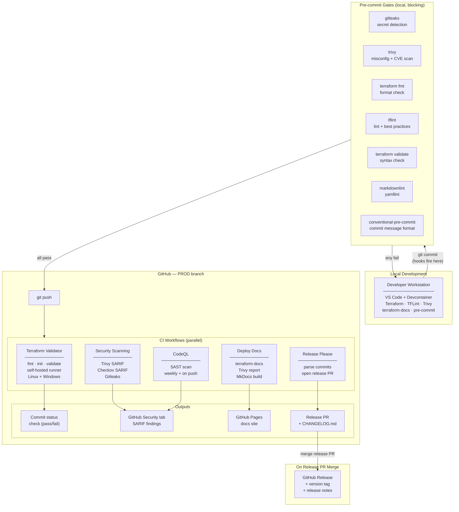
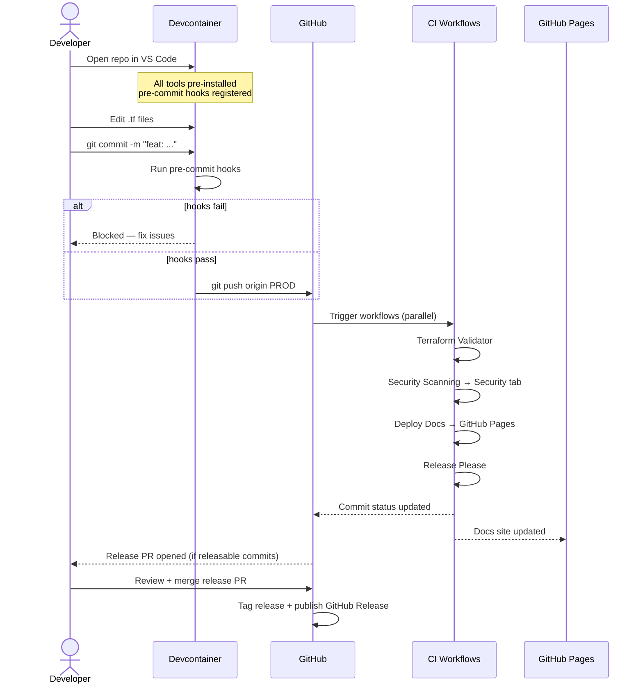

# Architecture

## Overview

This framework follows a **GitOps model** — the repository is the single source of truth for both
infrastructure definition and the toolchain that validates it. No infrastructure change can reach
`PROD` without passing every automated gate.

---

## GitOps Flow



---

## Developer Workflow



---

## Framework Consumption Pattern

This repo is a **framework** — it defines the Terraform structure, provider configuration, and
variable schema. Downstream repos consume it to deploy actual infrastructure.

```mermaid
flowchart LR
    subgraph framework["This Repository (framework)"]
        direction TB
        F1["providers.tf\nversions.tf"]
        F2["variables.tf\nall_systems schema"]
        F3["resources.tf\nlocals.tf"]
        F4["CI/CD pipeline\nquality gates"]
    end

    subgraph downstream["Downstream Infra Repo (consumer)"]
        direction TB
        D1["terraform.tfvars\nVM definitions"]
        D2["backend.tf\nremote state"]
        D3["Drift detection\nscheduled plan"]
    end

    subgraph proxmox["Proxmox VE Cluster"]
        P1["VMs / LXC containers"]
        P2["Storage pools"]
        P3["Network config"]
    end

    framework -->|"imported as\nTerraform module"| downstream
    downstream -->|"terraform apply\nbpg/proxmox provider"| proxmox
```



!!! tip "Drift detection belongs in the consumer"
    Because this framework uses `-backend=false` in CI (no live state), drift detection
    is the responsibility of the downstream repo — the one that runs `terraform apply`
    against a real Proxmox cluster and holds state in a remote backend.

    A downstream repo should run a **scheduled `terraform plan`** and alert on any
    non-empty diff, indicating that infrastructure has changed outside of Terraform.

---

## Security Control Layers

```mermaid
flowchart LR
    subgraph L1["Layer 1 — Local (pre-commit)"]
        S1["gitleaks\nno secrets committed"]
        S2["trivy\nno HIGH/CRITICAL misconfigs"]
        S3["detect-private-key\nno keys in repo"]
    end

    subgraph L2["Layer 2 — CI (every push)"]
        S4["Trivy SARIF\n→ Security tab"]
        S5["Checkov\nIaC compliance"]
        S6["Gitleaks\nfull history scan"]
    end

    subgraph L3["Layer 3 — Continuous (weekly)"]
        S7["CodeQL SAST\nworkflow scanning"]
        S8["Security Scanning\nscheduled full scan"]
        S9["Dependabot\ndependency updates"]
    end

    subgraph L4["Layer 4 — Supply Chain"]
        S10["Pinned Action SHAs\nno floating tags"]
        S11["persist-credentials: false\nno token leakage"]
        S12["Dependabot\nprovider + action versions"]
    end

    L1 -->|"blocked at commit"| L2
    L2 -->|"blocked at push"| L3
    L3 -->|"continuous monitoring"| L4
```



---

## Repository Structure

```text
proxmox-vm-terraform-framework/
│
├── .devcontainer/          # Reproducible dev environment (Ubuntu 24.04)
│   ├── devcontainer.json   # Features: Terraform, TFLint, Trivy, terraform-docs
│   └── Dockerfile
│
├── .github/
│   ├── actions/
│   │   ├── terraform-bash/        # Composite action — Linux runner
│   │   └── terraform-powershell/  # Composite action — Windows runner
│   ├── ISSUE_TEMPLATE/            # Structured bug + feature request forms
│   ├── workflows/
│   │   ├── terraform.yaml         # Format + validate on push
│   │   ├── security.yaml          # Trivy + Checkov + Gitleaks → SARIF
│   │   ├── pages.yaml             # MkDocs build + GitHub Pages deploy
│   │   ├── release-please.yaml    # Automated versioning + changelog
│   │   └── codeql.yaml            # SAST — weekly + on push
│   ├── CODEOWNERS
│   ├── dependabot.yml             # 5 ecosystems monitored
│   └── pull_request_template.md
│
├── .config/                # Tool configurations (linters, formatters, docs)
├── .vscode/                # Workspace settings + tasks
├── docs/                   # MkDocs source (deployed to GitHub Pages)
├── examples/               # Usage examples for consumers
├── requirements/           # Pinned Python deps (Dependabot-monitored)
├── terraform/              # Core Terraform configuration
│
├── .editorconfig
├── .gitignore
├── .pre-commit.config.yaml
├── release-please-config.json
└── .release-please-manifest.json
```
